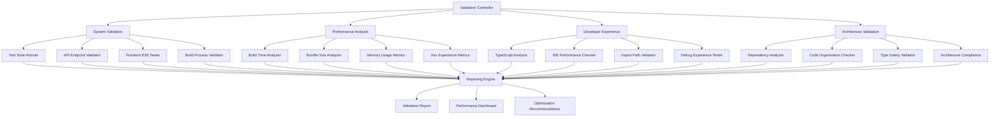

# Design Document

## Overview

Phase A: Validation & Optimization is designed to systematically validate the consolidated package architecture and measure the performance improvements achieved through the 58.6% package reduction. The design focuses on comprehensive testing, performance benchmarking, developer experience enhancement, and architectural validation to ensure the consolidation was successful and provides a solid foundation for future development.

## Architecture

### Validation Framework Architecture



### Package Structure Analysis

The consolidated architecture consists of:
- **3 Main Packages**: backend, frontend, shared
- **9 Specialized Packages**: @reporunner/* packages for specific domains
- **Centralized Configuration**: Root-level build, test, and lint configurations
- **Workspace Management**: PNPM workspace with Turbo for build orchestration

## Components and Interfaces

### 1. System Validation Component

**Purpose**: Validate that all functionality works correctly after consolidation

**Key Interfaces**:
```typescript
interface TestSuiteRunner {
  runAllTests(): Promise<TestResults>
  runPackageTests(packageName: string): Promise<TestResults>
  generateCoverageReport(): Promise<CoverageReport>
}

interface APIValidator {
  validateEndpoints(): Promise<EndpointResults>
  checkResponseFormats(): Promise<ValidationResults>
  testErrorHandling(): Promise<ErrorTestResults>
}

interface E2EValidator {
  runFrontendWorkflows(): Promise<WorkflowResults>
  validateUserJourneys(): Promise<JourneyResults>
  checkCrossPackageIntegration(): Promise<IntegrationResults>
}
```

**Implementation Strategy**:
- Leverage existing Vitest configuration with workspace-wide coverage
- Use Turbo for parallel test execution across packages
- Implement custom validators for API endpoints and frontend workflows
- Generate comprehensive test reports with actionable insights

### 2. Performance Analysis Component

**Purpose**: Measure and document performance improvements from consolidation

**Key Interfaces**:
```typescript
interface BuildAnalyzer {
  measureBuildTimes(): Promise<BuildMetrics>
  compareToPrevious(baseline: BuildMetrics): Promise<ComparisonReport>
  identifyBottlenecks(): Promise<BottleneckReport>
}

interface BundleAnalyzer {
  analyzeBundleSizes(): Promise<BundleMetrics>
  trackSizeReductions(): Promise<SizeReport>
  identifyOptimizations(): Promise<OptimizationSuggestions>
}

interface MemoryMonitor {
  profileMemoryUsage(): Promise<MemoryProfile>
  identifyLeaks(): Promise<LeakReport>
  suggestOptimizations(): Promise<MemoryOptimizations>
}
```

**Implementation Strategy**:
- Use Turbo's built-in build timing and caching metrics
- Implement bundle analysis using existing bundlemon configuration
- Create memory profiling tools for development and build processes
- Establish baseline metrics for future comparisons

### 3. Developer Experience Enhancement Component

**Purpose**: Improve development tools and workflows

**Key Interfaces**:
```typescript
interface TypeScriptAnalyzer {
  validateAutocomplete(): Promise<AutocompleteReport>
  checkTypeResolution(): Promise<TypeResolutionReport>
  measureCompilationSpeed(): Promise<CompilationMetrics>
}

interface IDEPerformanceChecker {
  measureNavigationSpeed(): Promise<NavigationMetrics>
  validateIntelliSense(): Promise<IntelliSenseReport>
  checkSourceMapping(): Promise<SourceMapReport>
}

interface ImportPathValidator {
  validatePathConsistency(): Promise<PathReport>
  checkCircularDependencies(): Promise<DependencyReport>
  suggestPathOptimizations(): Promise<PathOptimizations>
}
```

**Implementation Strategy**:
- Leverage TypeScript compiler API for analysis
- Create automated tests for IDE functionality
- Implement import path analysis using madge and custom tools
- Generate developer experience metrics and recommendations

### 4. Architecture Validation Component

**Purpose**: Validate architectural best practices and scalability

**Key Interfaces**:
```typescript
interface DependencyAnalyzer {
  checkCircularDependencies(): Promise<CircularDependencyReport>
  validatePackageBoundaries(): Promise<BoundaryReport>
  analyzeDependencyGraph(): Promise<DependencyGraph>
}

interface CodeOrganizationChecker {
  validateSeparationOfConcerns(): Promise<SeparationReport>
  checkCodeDuplication(): Promise<DuplicationReport>
  validateNamingConventions(): Promise<NamingReport>
}

interface TypeSafetyValidator {
  validateCrossPackageTypes(): Promise<TypeSafetyReport>
  checkInterfaceConsistency(): Promise<InterfaceReport>
  validateExportStructure(): Promise<ExportReport>
}
```

**Implementation Strategy**:
- Use madge for dependency analysis
- Implement custom tools for code organization validation
- Leverage TypeScript compiler for type safety validation
- Create architectural compliance checks

## Data Models

### Validation Results Model

```typescript
interface ValidationResults {
  timestamp: Date
  phase: 'A'
  status: 'success' | 'warning' | 'failure'

  systemValidation: {
    testResults: TestResults
    apiValidation: EndpointResults
    e2eResults: WorkflowResults
    buildValidation: BuildResults
  }

  performanceAnalysis: {
    buildMetrics: BuildMetrics
    bundleMetrics: BundleMetrics
    memoryProfile: MemoryProfile
    devExperienceMetrics: DevExperienceMetrics
  }

  architectureValidation: {
    dependencyAnalysis: DependencyReport
    codeOrganization: OrganizationReport
    typeSafety: TypeSafetyReport
  }

  recommendations: OptimizationRecommendation[]
  nextSteps: string[]
}

interface PerformanceMetrics {
  buildTime: {
    current: number
    baseline: number
    improvement: number
    target: number // 30% improvement
  }

  bundleSize: {
    current: number
    baseline: number
    reduction: number
    target: number // 20% reduction
  }

  memoryUsage: {
    development: MemoryStats
    build: MemoryStats
    runtime: MemoryStats
  }
}
```

### Reporting Model

```typescript
interface ValidationReport {
  summary: ValidationSummary
  detailedResults: ValidationResults
  performanceDashboard: PerformanceDashboard
  recommendations: RecommendationList
  documentation: DocumentationUpdate[]
}

interface PerformanceDashboard {
  charts: ChartData[]
  metrics: MetricCard[]
  trends: TrendAnalysis[]
  comparisons: ComparisonData[]
}
```

## Error Handling

### Validation Error Handling Strategy

1. **Graceful Degradation**: If one validation component fails, others continue
2. **Detailed Error Reporting**: Capture specific error contexts and stack traces
3. **Recovery Suggestions**: Provide actionable steps for resolving issues
4. **Rollback Capability**: Ability to revert to previous package structure if critical issues found

### Error Categories

```typescript
enum ValidationErrorType {
  TEST_FAILURE = 'test_failure',
  BUILD_ERROR = 'build_error',
  PERFORMANCE_REGRESSION = 'performance_regression',
  ARCHITECTURE_VIOLATION = 'architecture_violation',
  TYPE_ERROR = 'type_error',
  DEPENDENCY_ISSUE = 'dependency_issue'
}

interface ValidationError {
  type: ValidationErrorType
  severity: 'critical' | 'warning' | 'info'
  message: string
  context: ErrorContext
  suggestions: string[]
  affectedPackages: string[]
}
```

## Testing Strategy

### Multi-Level Testing Approach

1. **Unit Testing**: Validate individual validation components
2. **Integration Testing**: Test cross-package functionality
3. **System Testing**: End-to-end validation of entire architecture
4. **Performance Testing**: Benchmark and regression testing
5. **Acceptance Testing**: Validate against Phase A requirements

### Test Implementation

```typescript
// Example test structure for validation components
describe('Phase A Validation Suite', () => {
  describe('System Validation', () => {
    test('should run all package tests successfully', async () => {
      const results = await testSuiteRunner.runAllTests()
      expect(results.overallStatus).toBe('success')
      expect(results.coverage.overall).toBeGreaterThan(70)
    })

    test('should validate all API endpoints', async () => {
      const results = await apiValidator.validateEndpoints()
      expect(results.failedEndpoints).toHaveLength(0)
    })
  })

  describe('Performance Analysis', () => {
    test('should achieve 30% build time improvement', async () => {
      const metrics = await buildAnalyzer.measureBuildTimes()
      const improvement = metrics.improvementPercentage
      expect(improvement).toBeGreaterThanOrEqual(30)
    })

    test('should achieve 20% bundle size reduction', async () => {
      const metrics = await bundleAnalyzer.analyzeBundleSizes()
      const reduction = metrics.reductionPercentage
      expect(reduction).toBeGreaterThanOrEqual(20)
    })
  })
})
```

### Continuous Validation

- **Pre-commit Hooks**: Run validation checks before commits
- **CI/CD Integration**: Automated validation in build pipeline
- **Monitoring**: Ongoing performance monitoring and alerting
- **Regression Detection**: Automated detection of performance regressions

## Implementation Phases

### Phase A.1: Foundation Setup
- Set up validation framework infrastructure
- Configure performance monitoring tools
- Establish baseline metrics

### Phase A.2: System Validation
- Implement comprehensive test suite execution
- Validate API endpoints and functionality
- Run end-to-end frontend testing

### Phase A.3: Performance Analysis
- Measure build time improvements
- Analyze bundle size reductions
- Profile memory usage and optimization opportunities

### Phase A.4: Developer Experience
- Validate TypeScript improvements
- Test IDE performance enhancements
- Optimize import paths and navigation

### Phase A.5: Architecture Validation
- Analyze dependency structure
- Validate code organization
- Ensure type safety across packages

### Phase A.6: Reporting and Documentation
- Generate comprehensive validation report
- Create performance dashboard
- Update documentation with findings and recommendations
