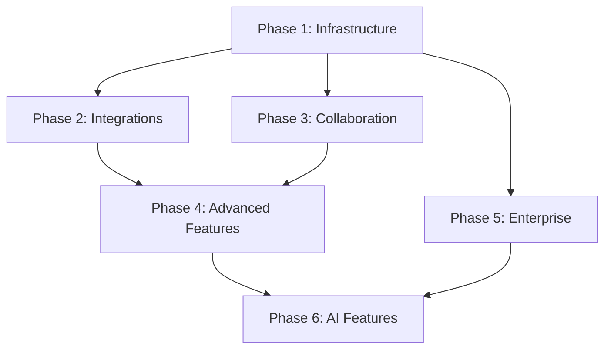

# LLM Implementation Guide: Structured Development Approach

## Overview

This guide provides a structured approach for LLMs to implement the planned features in Reporunner, with clear dependencies, implementation order, and detailed specifications for each component.

## Implementation Phases & Dependencies



## Phase 1: Infrastructure Foundation (Critical Path)

### 1.1 Monorepo Migration (Week 1)

**Dependencies**: None
**Difficulty**: Medium
**Files to Create/Modify**:

```bash
# New package structure
reporunner/
├── packages/
│   ├── @reporunner/core/
│   ├── @reporunner/api-types/
│   ├── @reporunner/backend-common/
│   ├── @reporunner/constants/
│   └── @reporunner/db/
├── turbo.json
├── pnpm-workspace.yaml
└── package.json (root)
```

**Implementation Steps**:

1. Create root `pnpm-workspace.yaml`
2. Setup `turbo.json` with build pipelines
3. Move existing code to `@reporunner/core` package
4. Create shared type definitions in `@reporunner/api-types`
5. Setup dependency injection in `@reporunner/di`

**Key Files**:

- `pnpm-workspace.yaml` - Workspace configuration
- `turbo.json` - Build pipeline definitions
- `packages/@reporunner/core/package.json` - Core package definition

### 1.2 Database Architecture (Week 2)

**Dependencies**: Monorepo setup
**Difficulty**: High
**Implementation Focus**: Hybrid MongoDB + PostgreSQL

**Files to Create**:

```typescript
// packages/@reporunner/db/src/
├── mongodb/
│   ├── connection.ts
│   ├── schemas/
│   └── repositories/
├── postgresql/
│   ├── connection.ts
│   ├── migrations/
│   └── repositories/
└── database-service.ts
```

**Implementation Steps**:

1. Setup MongoDB connection with proper schema validation
2. Setup PostgreSQL with pgvector extension
3. Create database service with intelligent routing
4. Implement migration system for both databases
5. Add comprehensive error handling and connection pooling

**Key Components**:

- `DatabaseService` class with smart routing
- MongoDB schemas for workflows, users, executions
- PostgreSQL tables for embeddings, analytics
- Migration system for schema updates

### 1.3 Authentication System (Week 3)

**Dependencies**: Database architecture
**Difficulty**: High
**Implementation Focus**: Enterprise-grade auth with RBAC

**Files to Create**:

```typescript
// packages/@reporunner/auth/src/
├── jwt/
│   ├── token-manager.ts
│   └── token-validator.ts
├── rbac/
│   ├── permission-engine.ts
│   └── role-manager.ts
├── sso/
│   ├── oauth2-provider.ts
│   └── saml-provider.ts
└── mfa/
    ├── totp-provider.ts
    └── sms-provider.ts
```

**Implementation Steps**:

1. Create JWT token management system
2. Implement RBAC with hierarchical permissions
3. Add SSO providers (Google, Microsoft, GitHub)
4. Implement MFA with TOTP and SMS
5. Create API key management system

**Key Features**:

- JWT with refresh token rotation
- Granular permission system
- Multi-provider SSO support
- MFA with backup codes

## Phase 2: Integration Ecosystem (Parallel to Phase 1)

### 2.1 Core Integration Framework (Week 2-3)

**Dependencies**: Package structure, authentication
**Difficulty**: Medium
**Implementation Focus**: Scalable integration architecture

**Files to Create**:

```typescript
// packages/@reporunner/integrations/src/
├── base/
│   ├── base-integration.ts
│   ├── base-node.ts
│   └── credential-manager.ts
├── oauth/
│   ├── oauth-handler.ts
│   └── token-refresh.ts
└── webhook/
    ├── webhook-manager.ts
    └── event-processor.ts
```

**Implementation Steps**:

1. Create base integration classes
2. Implement OAuth2 flow handling
3. Setup webhook infrastructure
4. Create credential encryption system
5. Add integration testing framework

### 2.2 Tier 1 Integrations (Week 4-6)

**Dependencies**: Integration framework
**Difficulty**: Medium-High
**Priority Order**: Gmail → Slack → OpenAI → GitHub → MongoDB

**Implementation Pattern per Integration**:

```typescript
// packages/@reporunner/nodes-communication/src/gmail/
├── node.ts              # Node definition
├── properties.ts        # Form properties
├── credentials.ts       # Auth configuration
├── actions/
│   ├── send-email.ts
│   ├── read-emails.ts
│   └── manage-labels.ts
└── triggers/
    ├── new-email.ts
    └── email-replied.ts
```

**Implementation Strategy**:

1. Start with Gmail (most complex OAuth2 flow)
2. Use Gmail patterns for other OAuth2 integrations
3. Implement comprehensive error handling
4. Add rate limiting and retry logic
5. Create integration test suites

## Phase 3: Real-time Collaboration (Parallel Implementation)

### 3.1 WebSocket Infrastructure (Week 3-4)

**Dependencies**: Authentication system
**Difficulty**: High
**Implementation Focus**: Scalable real-time communication

**Files to Create**:

```typescript
// packages/@reporunner/real-time/src/
├── socket-server/
│   ├── socket-manager.ts
│   ├── room-manager.ts
│   └── event-handlers/
├── presence/
│   ├── presence-tracker.ts
│   └── cursor-manager.ts
└── operational-transform/
    ├── operation-engine.ts
    └── conflict-resolver.ts
```

**Implementation Steps**:

1. Setup Socket.IO server with Redis adapter
2. Implement room-based communication
3. Create presence tracking system
4. Add operational transform for concurrent editing
5. Implement conflict resolution algorithms

### 3.2 Live Collaboration Features (Week 5-6)

**Dependencies**: WebSocket infrastructure
**Difficulty**: Medium-High
**Implementation Focus**: User experience and conflict handling

**Key Components**:

- Real-time cursor tracking with smooth interpolation
- Live property synchronization with field-level locking
- Comment system with threading and mentions
- Version control with automatic snapshots

**Implementation Priority**:

1. Cursor tracking (immediate visual feedback)
2. Node position synchronization
3. Property editing with conflict detection
4. Comment system implementation

## Phase 4: Advanced Features (Dependent on Previous Phases)

### 4.1 Enhanced Debugging (Week 7-8)

**Dependencies**: Execution engine, real-time infrastructure
**Difficulty**: High
**Implementation Focus**: Professional debugging experience

**Files to Create**:

```typescript
// packages/@reporunner/debug-tools/src/
├── debugger/
│   ├── execution-debugger.ts
│   ├── breakpoint-manager.ts
│   └── variable-inspector.ts
├── profiler/
│   ├── performance-profiler.ts
│   └── memory-analyzer.ts
└── testing/
    ├── workflow-tester.ts
    └── mock-data-manager.ts
```

**Implementation Steps**:

1. Enhance execution engine with debugging hooks
2. Implement breakpoint system with conditions
3. Create variable watching and inspection
4. Add execution replay functionality
5. Implement performance profiling

### 4.2 Container Node System (Week 9-10)

**Dependencies**: Enhanced execution engine
**Difficulty**: High
**Implementation Focus**: Complex workflow logic

**Key Components**:

- Loop containers with sophisticated iteration control
- Parallel containers with concurrency management
- Conditional containers with expression evaluation
- Try-catch containers with retry policies
- Batch containers with size and delay controls

## Phase 5: Enterprise Features (Security Focus)

### 5.1 Security & Compliance (Week 11-12)

**Dependencies**: Authentication, audit logging
**Difficulty**: High
**Implementation Focus**: SOC2 compliance

**Files to Create**:

```typescript
// packages/@reporunner/enterprise-security/src/
├── audit-logging/
│   ├── audit-logger.ts
│   ├── tamper-detection.ts
│   └── compliance-reporter.ts
├── policy-engine/
│   ├── security-policies.ts
│   └── policy-enforcer.ts
└── vulnerability-scanner/
    ├── dependency-scanner.ts
    └── security-scanner.ts
```

**Implementation Steps**:

1. Implement comprehensive audit logging
2. Add tamper detection with cryptographic verification
3. Create security policy engine
4. Add vulnerability scanning
5. Implement compliance reporting

### 5.2 Multi-tenant Architecture (Week 13-14)

**Dependencies**: Database architecture, authentication
**Difficulty**: High
**Implementation Focus**: Complete tenant isolation

**Key Components**:

- Tenant-aware database queries
- Resource isolation and limits
- Custom branding capabilities
- Billing and usage tracking

## Phase 6: AI Features (Advanced Implementation)

### 6.1 Natural Language Workflow Builder (Week 15-16)

**Dependencies**: Complete workflow system, AI integrations
**Difficulty**: Very High
**Implementation Focus**: AI-powered workflow generation

**Files to Create**:

```typescript
// packages/@reporunner/ai-assistant/src/
├── nlp/
│   ├── intent-analyzer.ts
│   ├── workflow-generator.ts
│   └── node-suggester.ts
├── optimization/
│   ├── performance-optimizer.ts
│   └── pattern-recognizer.ts
└── prediction/
    ├── error-predictor.ts
    └── maintenance-predictor.ts
```

**Implementation Steps**:

1. Integrate with LLM APIs (OpenAI, Anthropic)
2. Create workflow intent analysis
3. Implement node suggestion system
4. Add optimization recommendations
5. Create predictive analytics

## Implementation Best Practices for LLMs

### Code Organization

```typescript
// Follow consistent patterns
interface ServiceConfig {
  enabled: boolean;
  options: Record<string, any>;
  dependencies: string[];
}

abstract class BaseService {
  abstract initialize(config: ServiceConfig): Promise<void>;
  abstract healthCheck(): Promise<boolean>;
  abstract shutdown(): Promise<void>;
}
```

### Error Handling

```typescript
// Comprehensive error handling
class ServiceError extends Error {
  constructor(
    message: string,
    public code: string,
    public service: string,
    public recoverable: boolean = true,
  ) {
    super(message);
    this.name = "ServiceError";
  }
}
```

### Testing Strategy

```typescript
// Test organization
src/
├── __tests__/
│   ├── unit/
│   ├── integration/
│   └── e2e/
├── __mocks__/
└── test-utils/
```

### Documentation Requirements

- TSDoc comments for all public APIs
- README.md for each package
- Architecture decision records (ADR)
- API documentation with examples

## Implementation Checkpoints

### Week 2 Checkpoint

- [ ] Monorepo structure complete
- [ ] Database connections working
- [ ] Basic authentication functional

### Week 4 Checkpoint

- [ ] Core integrations (Gmail, Slack) working
- [ ] Integration framework stable
- [ ] WebSocket infrastructure functional

### Week 6 Checkpoint

- [ ] Real-time collaboration basic features
- [ ] Tier 1 integrations complete
- [ ] Authentication system enterprise-ready

### Week 8 Checkpoint

- [ ] Enhanced debugging tools
- [ ] Container node system
- [ ] Performance profiling

### Week 12 Checkpoint

- [ ] Enterprise security features
- [ ] SOC2 compliance framework
- [ ] Multi-tenant architecture

### Week 16 Checkpoint

- [ ] AI-powered features
- [ ] Complete integration ecosystem
- [ ] Production-ready system

## Risk Mitigation

### High-Risk Components

1. **Real-time Collaboration**: Complex conflict resolution
2. **Database Migration**: Data integrity during migration
3. **AI Integration**: LLM API reliability and costs
4. **Security Implementation**: Compliance requirements

### Mitigation Strategies

- Implement feature flags for gradual rollouts
- Create comprehensive test suites
- Use database transactions for data consistency
- Implement circuit breakers for external APIs
- Regular security audits and penetration testing

---

_This guide provides a structured approach for LLM implementation_
_Focus on one phase at a time with clear dependencies_
_Each component should be fully tested before moving to the next_
